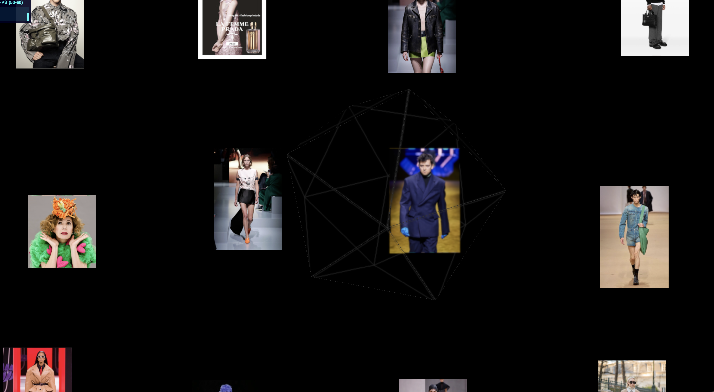
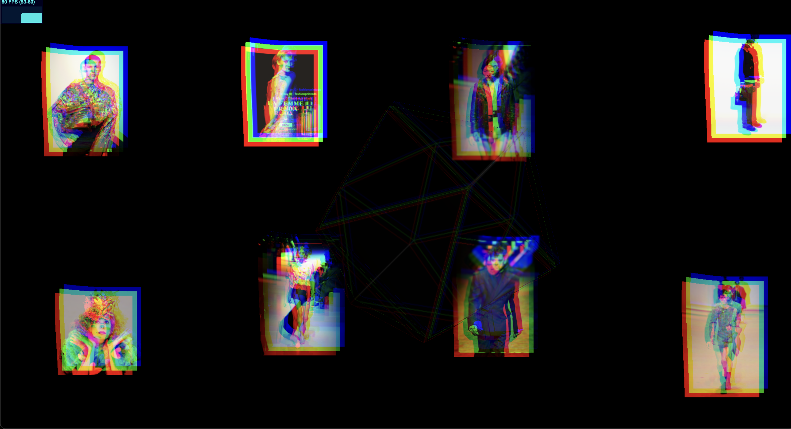
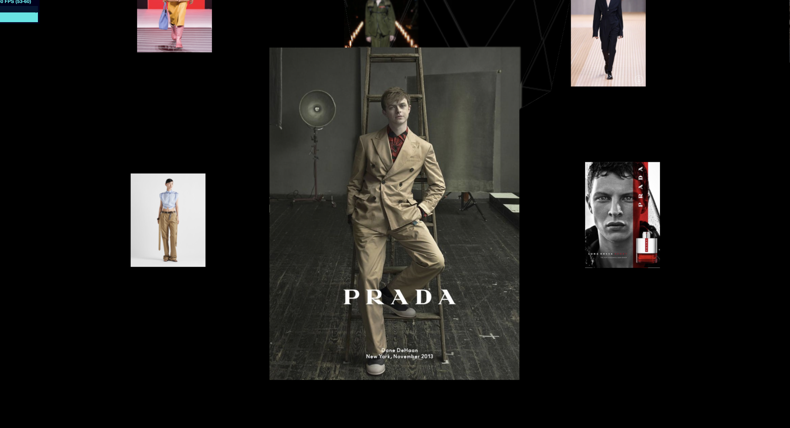

# Pictures showcase

> Final project for the module `Webgl in Practice` at [Harbour.Space](https://harbour.space).

Showcase of pictures using Threejs + gsap with postprocessing effects and custom shaders for GPU optimization.

<!-- divs grid -->

    
    
    

## Description

Whenever a user moves the mouse far from the center of the screen (biased by a circular area), the camera starts to move in the direction of the mouse.
Causing a bend of the images in the same direction and a chromatic aberration effect.
Once the user clicks on an image, the camera moves to the image position and it starts to zoom in. While in this state, users are not
able to move the camera.

## Features

- Postprocessing (Chromatic aberration).
- Interactivity through mouse movement and collision detection (Raycaster).
- Custom shader materials (Image bending).
- Soft transitions (gsap).
- Proper images tone mapping (RGB) and treatment for keeping the original aspect ratio.
- Proper DPR management for high-resolution displays.
- Directional light (just for reflecting light on the material of the icosahedron).

## Implementation details

- Images are always rendered in random positions but keeping a grid-like structure (grid positions -+ noise).
- Bending effect is applied on the borders of the images that are close to the mouse direction (rather than from the UV center as seen in class).
- Icosahedron follows the camera position after some delay.
